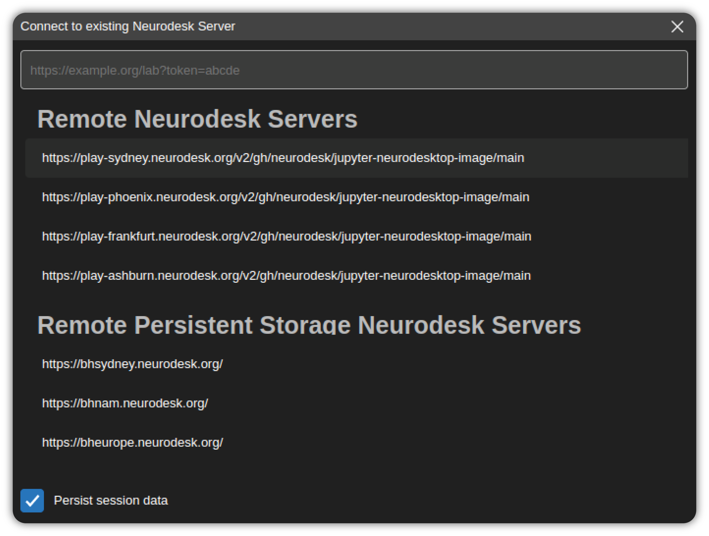

# Connecting to a remote Neurodesk Server

Neurodesk Desktop creates new Neurodesk sessions by launching a locally running Neurodesk server and connecting to it. It can also connect to an existing Neurodesk server instance that is running remotely. In order to connect to a server, click the `Connect to remote Neurodesk server..` button in the Start section of the Welcome Page.


This will launch a dialog that automatically lists the remote Neurodesk server instances.



Select a server from the list or enter the URL of the Neurodesk application server. If the server requires a token for authentication, make sure to include it as a query parameter of the URL as well (`/lab?token=<token-value>`). After entering a URL hit `Enter` key to connect.

If the `Persist session data` option is checked, then the session information is stored and Neurodesk Desktop will re-use this data on the next launch. If this option is not checked, the session data is automatically deleted at the next launch and servers requiring authentication will prompt for re-login.

You can delete the stored session data manually at any time by using the `Clear History` option in the Privacy tab of Settings dialog.


# Configuration and data files

Neurodesk Desktop stores data in ~/neurodesktop-storage as default.

# Uninstalling Neurodesk Desktop

## Debian, Ubuntu Linux

```bash
sudo apt-get purge neurodesktop-desktop # remove application
rm /usr/bin/neurodesktop # remove command symlink

# to remove application cache
rm -rf ~/.config/neurodesktop-desktop
```

## Red Hat, Fedora, SUSE Linux

```bash
sudo rpm -e neurodesktop-desktop # remove application
rm /usr/bin/neurodesktop # remove command symlink

# to remove application cache
rm -rf ~/.config/neurodesktop-desktop
```

### macOS

Find the application installation `Neurodesktop.app` in Finder (in /Applications or ~/Applications) and move to Trash by using `CMD + Delete`. Clean other application generated files using:

```bash
rm -rf ~/Library/neurodesktop-desktop # to remove application cache
rm -rf ~/Library/Application\ Support/neurodesktop-desktop # to remove user data
```

### Windows

On Windows, go to `Windows Apps & Features` dialog using `Start Menu` -> `Settings` -> `Apps` and uninstall Neurodesk Desktop application as shown below.

In order to remove application cache, delete `C:\Users\<username>\AppData\Roaming\neurodesktop-desktop` directory.
